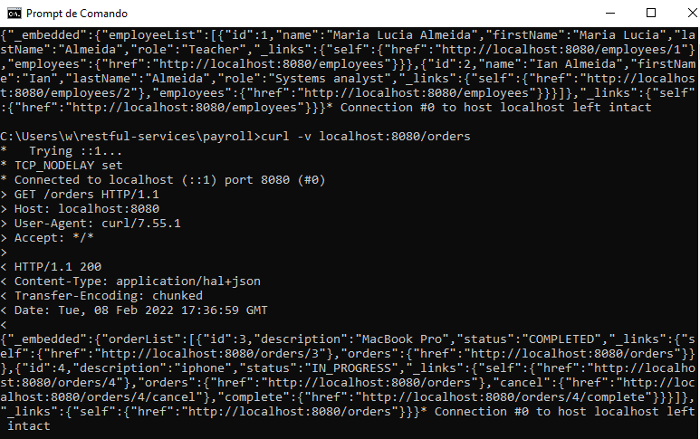

# REST services with Spring
Building a Restful service that addresses concepts of REST, MVC architecture and HATEOAS.

# Description
The developed application is a hypertext oriented payroll service; that is, the application must have links to other resources. <br> Thus, for the service to be Restful, it is necessary to add hypermedia that contains links to other types of media such as images, videos and text. <br> For this, HATEOAS (Hypermedia as the Engine of Application State) was used, which is a restriction of the REST architecture. <br>

With the MVC architecture, especially the controller, and the client-server architecture, the controller, <br> which operates on the server side, handles requests and returns JSON representations of resources. <br>

Each line of code was commented with the aim of learning and reusing the concepts.

# Getting Started
## Dependencies
- Spring Tools Suite 4.
- Git.

# Installation
In your code editor:
```
git clone (repository)
```

# Executing program
- Open STS and import the project.
- Right-click the public static void main in PayRollApplication and run.
- Open the terminal and type: curl -v localhost:8080/employees and curl -v localhost:8080/orders 


# Acknowledgments
- https://spring.io/guides/tutorials/rest/
- https://restfulapi.net/hateoas/
